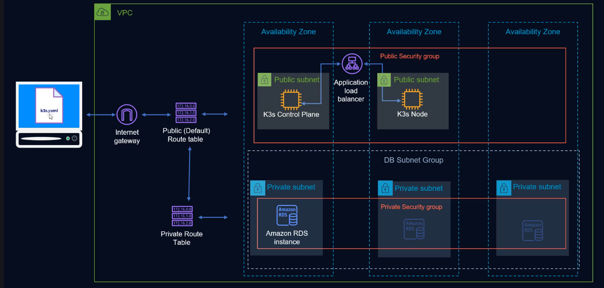

# Automating AWS Infrastructure with Terraform and K3s

Just wrapped up an end-to-end infrastructure automation project using Terraform to deploy a lightweight Kubernetes cluster (K3s) on AWS EC2, fully backed by Amazon RDS (MySQL) as the external datastore.

---
### Project Highlights:
- Modular Terraform Setup — with separate modules for `networking`, `database,` `compute` and `load balancing`.
- K3s Cluster Bootstrap ( Fully automated K3s setup on each instance without manual intervention ):
    - userdata.tpl: A shell script rendered by Terraform that automatically installs the K3s server
    on EC2 instances.
        - Connects to RDS using `--datastore-endpoint`.
        - Adds the instance's public IP as a TLS SAN.
- External MySQL Datastore:
    - RDS - MySQL used as a K3s datastore.
- scp_script.tpl:
    - A local-exec provisioner script that copies the generated k3s.yaml kubeconfig file from the EC2 instance to the local machine.
    - Dynamically renames each config based on node name.
    - Automatically replaces the default 127.0.0.1 with the node's public IP — making the cluster remotely accessible.

- Application Load Balancer (ALB):
    - Routes HTTP traffic to EC2-hosted K3s worker nodes via Target Groups.
- Nginx App Deployment: 
    - Deployed to K3s using a Kubernetes YAML manifest as a proof-of-concept workload.

---
